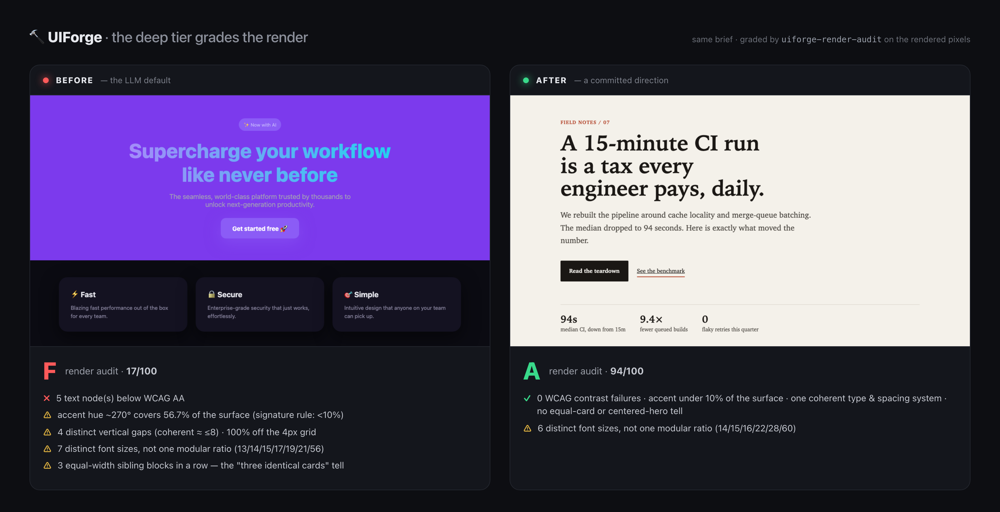

<h1 align="center">🔨 UIForge</h1>

<p align="center">
  <strong>AI slop이 아니라 명작 UI를 벼려낸다 — Claude Code를 위한 디자인 컴파일러.</strong><br>
  <em>모델에게 "예쁘게 만들라"고 <b>조언</b>하는 스킬이 아니다. 중앙값을 <b>거부</b>하는 시스템이다 — 디자인 서명을 토큰으로 방출하고, 진짜 서체를 조달하고, build → lint → fix를 반복해 slop을 빌드 에러로 만들고, 픽셀만 받은 적대자가 "기계가 만들었다"를 증명하지 못할 때까지 배포하지 않는다.</em>
</p>

<p align="center">
  <a href="./README.md"></a>
</p>

<p align="center">
  
  
  
  
</p>

<p align="center">
  
  
  
  
  
</p>

<p align="center">
  
  
  
  
  
</p>

<p align="center">
  
</p>
<p align="center"><sub><em><b>딥 티어</b>가 소스가 아니라 <b>렌더된 픽셀</b>을 채점한다 — 실제 WCAG 대비·accent 표면적·간격 리듬·레이아웃 tell. 왼쪽: LLM이 기본으로 내는 페이지, <b>F(17/100)</b> — 대비 5건 실패(gradient headline이 <code>transparent</code>라 문자 그대로 1:1), accent가 표면의 57%, 동일 카드 3개. 오른쪽: 확정된 방향, <b>A(94/100)</b>. 내장 <code>uiforge-render-audit</code>로 채점 — 재현: <code>node tools/uiforge-render-audit.mjs docs/examples/slop.html</code>. <a href="#증거-vibes가-아니라">자세히 ↓</a></em></sub></p>

---

## UIForge라는 이름에 대하여

**대장간(forge)** 은 금속을 *생성*하지 않는다. 원재료를 받아 열과 힘을 틀에 대고,
형태가 아닌 모든 것을 두들겨 쳐낸 뒤, 담금질로 그 형태를 고정한다. 이 플러그인이 UI를
대하는 자세가 정확히 그렇다.

원재료는 모델의 기본 본능이다. 아무 LLM에게 "예쁜 랜딩 만들어"라고 하면 매번 같은
페이지가 나온다: 흰 배경의 **Inter**, **보라→파랑 그라디언트** 히어로, **중앙정렬**
헤드라인, **똑같은 둥근 카드 3장.** 이건 더 나은 프롬프트로 고치는 버그가 아니라
**distributional convergence(분포 수렴)** 다: 열린 선택(폰트·색·레이아웃·모션·카피)마다
모델은 최고확률 토큰을 내고, 그 최고확률 답이 곧 훈련데이터 중앙값이다. 중앙값이 slop이고,
slop은 한눈에 티가 난다.

UIForge의 일은 **기본값을 결정으로 바꾸고, 그 결정을 강제하는 것**이다. 관점 하나에
커밋하고, *컴포넌트 이전에* 디자인 서명을 토큰으로 방출하고, 진짜 서체와 검증된 컴포넌트를
조달한 뒤 — 여기가 조언만 하는 스킬은 못 하는 부분이다 — **slop에서 빌드를 실패시키는
린터를 돌리고 그 린터가 통과할 때까지 반복한다.** 조언은 모델의 사전확률과 경쟁하다 진다.
게이트는 경쟁하지 않는다. 거부한다.

> **한 줄로:** UIForge는 디자인 *컴파일러*다 — 의도를 넣으면 담금질된 slop-free UI가 나오고,
> 중앙값이 새어 나오면 빌드가 빨갛게 뜬다.

## 일반적인 AI-UI 도구가 하지 못하는 것

| 축 | UIForge | 평범한 Claude / v0 / Lovable / bolt |
|---|---|---|
| 취향이 적용되는 방식 | **강제** — 린터가 slop에서 비-0 종료; `/forge`가 0 될 때까지 반복 | 시스템 프롬프트로 제안, 혹은 없음; 압박 오면 무시 가능 |
| 기본값(Inter·보라·중앙·slate) | **실제 검사로 차단** + 설치된 키트로 대체 | 자주 방출됨 — 그게 바로 티 |
| 서명이 사는 곳 | 방출된 `tokens.css` + `motion.ts`; 모든 값이 여기서 파생 | 흩뿌린 인라인 리터럴 |
| 컴포넌트 | **취향 등급** 레지스트리 allowlist에서 설치(provenance), 창작 금지 | 손으로 짠 변형, 혹은 효과-맥시멀리스트 덤프 |
| "완료"의 기준 | 린터 = 0 **그리고** 픽셀만 받은 적대자가 AI임을 증명 못 함 | "내가 보기엔 괜찮은데"(자가채점, 낙관 편향) |
| *남의* UI 리뷰 | `uiforge score <dir│PR>` → 텔과 함께 A–F 등급 | — |
| *렌더 결과* 채점 | `uiforge-render-audit <url>`가 실제 WCAG 대비·accent 표면적·간격 리듬·레이아웃 tell을 픽셀에서 측정 | 소스에서 자가채점(있다면); 대비/커버리지/리듬은 통째로 놓침 |
| 실행 위치 | 로컬, 당신의 Claude Code 세션; 무의존성 Node | 호스팅 제품 / 웹앱 |
| 당신의 디자인 결정 | 당신이 소유한 평문 — 키트·토큰·규칙, 편집·`git diff` 가능 | 원격 모델의 불투명한 동작 |

## 증거, vibes가 아니라

**격리된** 헤드리스 Claude Code 2회 실행(`--setting-sources project` — 다른 스킬이 양쪽을
돕지 못하게), 같은 브리프·모델·스타터. *before*는 플러그인 없는 평범한 프롬프트, *after*는
UIForge를 `/uiforge:forge`(강제 루프)로. 둘 다 내장 린터 `tools/uiforge-lint.mjs`로 채점:

| run | lint 등급 | score | blockers |
|---|---|---|---|
| **before** — 플러그인 없음 | **F** | 206 | **3** (AI-보라 · 그라디언트 헤드라인 · reduced-motion 없음) |
| **after** — UIForge `/forge` | **A+** | 0 | **0** |

*after* 런에서 루프가 실제로 돌았다: **Precise** 방향에 커밋 → **진짜 서체 설치**(Hanken
Grotesk, system-ui 아님) → `tokens.css` + `motion.ts` 방출 → `uiforge-lint --strict` 반복
실행하며 **0 될 때까지 수정** → reduced-motion 경로 추가 → 중앙 SaaS 템플릿을 비대칭
에디토리얼로. 정직한 초기 교훈: **프로즈-only 가이드(v2)는 blocker 3개 — 실질 변화 없었다.
오직 기계장치(v3)가 F → A+로 뒤집었다.** 아무 프로젝트에서 재현: `node tools/uiforge-lint.mjs <dir>`.

**두 층위의 증명.** 위 표는 *소스* 게이트(grep)가 실제 런을 뒤집은 것이다. 맨 위 히어로
이미지는 *딥* 티어다: `uiforge-render-audit`가 페이지를 렌더해 grep이 못 보는 것을 채점한다 —
텍스트 노드별 실제 WCAG 대비, accent가 표면의 몇 %인지, 기하학에서 측정한 간격 리듬·타입 정합,
레이아웃 tell(동일 카드·중앙 히어로). LLM 기본값은 **F(17/100)** 로 대비 5건 실패(gradient
headline이 `transparent`라 **1:1**), 확정된 방향은 **A(94/100)**. 더 나은 프롬프트로 2.9:1
대비를 피할 수는 없다 — 재현: `node tools/uiforge-render-audit.mjs docs/examples/slop.html`.

## 핵심 원리: slop은 빌드 에러다

여기 모든 것은 한 수에서 파생된다 — **취향을 게이트로 만든다.**

- 마크다운 스킬은 *조언*이다: 모델의 사전확률 옆에 놓여, 토큰/시간 압박이 오면 진다.
  (계측: v2의 프로즈는 blocker 3개를 남겼다.)
- **린터**는 조언이 아니다. `tools/uiforge-lint.mjs`는 소스를 스캔해 slop을 지목하고
  **비-0으로 종료**한다. pre-commit 훅 / CI로 심으면 slop은 커밋조차 못 한다. (빠른 무의존성 티어.)
- **렌더 감사**는 grep이 못 가는 곳으로 간다. `tools/uiforge-render-audit.mjs`는 페이지를
  렌더해 전문가가 *결과물*에서 비평하는 크래프트를 측정한다 — 텍스트 노드별 실제 WCAG 대비,
  accent가 표면의 몇 %인지, 기하학 기반 간격 리듬·타입 정합, AI 레이아웃 tell. 게임 불가:
  키워드로 2.9:1 대비를 지워낼 수 없다. (딥 티어; 브라우저 필요.)
- `/uiforge:forge`는 모델이 **두 게이트에 대해 반복**하게 만든다 — build → lint →
  render-audit → 정확한 위반 수정 → 둘 다 통과할 때까지 반복 — 그다음 렌더된 픽셀에
  어드버서리얼 디텍터를 돌린다.

따라서 기준은 "모델이 취향을 내려 애썼다"가 아니다. **"스크린샷만 받은 적대자가 기계가
만들었음을 증명하지 못한다"** 이다. 이게 제품의 전부다.

## 포지(forge) 사이클, 단계별 해설

의도 먼저, 컴포넌트는 맨 마지막. 효과를 먼저 정하면 장식으로 끝난다.

| 단계 | 하는 일 | 스킬 / 커맨드 | 산출물 |
|---|---|---|---|
| **1. 논지** | 한 문장: 대상 · 느낌 · 기억될 단 하나 | `design-director` | 커밋할 브리프 |
| **2. 방향** | 관점 하나에 커밋("모던하고 깔끔" 금지) | `directions.md` | Editorial · Precise · Brutalist · Warm · Maximalist |
| **3. 서명** | `tokens.css` + `motion.ts`를 키트에서 **먼저** 방출 | `design-tokens` + `tools/kits/` | 진짜 폰트·액센트 하나·8px 스케일·모션 서명 |
| **4. 조달** | 검증 컴포넌트 설치(provenance), 창작 금지 | `registry-map.md` + shadcn MCP | 진짜·접근성 컴포넌트 |
| **5. 조합** | 시그니처 하나, 나머지는 정적, 모든 상태 설계 | `motion`, `content` | 완성된 뷰 |
| **6. 강제(루프)** | `uiforge-lint --strict`(소스) → `uiforge-render-audit`(렌더) → 수정 → **둘 다 통과**할 때까지; 그다음 어드버서리얼 디텍터 | `/forge`, `/critique`, `slop-detector.md` | 두 게이트 티어를 통과한 빌드 |
| **7. 뺄셈** | 가장 정당성 약한 하나 제거 | `critique.md` | 덜어낸 액세서리 |

## 다섯 가지 방향

프로젝트마다 하나를 고르면 토큰·폰트·모션·조달 레지스트리가 고정된다. 각 방향은 진짜
비-기본 서체가 박힌 **바로 쓰는 키트**(`tools/kits/`)로 배포된다 — `src/index.css`에 넣으면
키트만으로 린트 clean(score 0).

| 방향 | 성격 | 디스플레이 / mono 폰트 | 액센트 |
|---|---|---|---|
| **Editorial** | 매거진, 비대칭, 큰 타입 | Fraunces / — | rust `#B4472E` |
| **Precise** | Swiss 그리드 × Linear; 차분·정확 | Hanken Grotesk / JetBrains Mono | 일렉트릭 블루 `#4C8DFF` |
| **Brutalist** | 원초적·고대비·하드 섀도 | Archivo / Space Mono | 플랫 옐로 `#FFE500` |
| **Warm** | 부드럽고 인간적·스프링 | Bricolage Grotesque / JetBrains Mono | 테라코타 `#E07A5F` |
| **Maximalist** | 대담·레이어드·키네틱 — 그래도 시그니처 하나 | Unbounded / — | 마젠타 `#FF2E88` |

어느 것도 Inter/Roboto/system-ui가 아니다 — 이것만으로 가장 큰 blocker가 해소된다.

## 설치

### 사전 요구사항

- **Claude Code** (플러그인은 세션 안에서 동작).
- **Node** (무의존성 린터/도구용).
- 컴포넌트가 실제 동작하려면 **React / Next.js + Tailwind CSS + [Motion](https://motion.dev)**
  프로젝트(Tailwind v4 권장). `shadcn` init은 MCP/레지스트리 설치에만 필요하고, 아니면
  `npx motion-primitives add`가 대안이다.

### 플러그인으로 설치

```
/plugin marketplace add TaewoooPark/UIForge
/plugin install uiforge@uiforge
```

로컬: `git clone https://github.com/TaewoooPark/UIForge.git && claude --plugin-dir ./UIForge`.
번들된 `.mcp.json`이 공식 **shadcn MCP**(`npx shadcn@latest mcp`)를 띄운다 — 커스텀 MCP 없음.

### 프로젝트 부트스트랩 (빠른 길)

기존 앱을 slop이 못 들어오게 배선한다 — 토큰 키트·린터·npm 스크립트·pre-commit 훅·CI를
한 번에:

```bash
node <plugin>/tools/create-uiforge.mjs precise .    # editorial | precise | brutalist | warm | maximalist
npm run lint:ui                                       # 게이트
```

그다음 세션에서 파이프라인 구동:

```
/uiforge:forge  개발자 도구 스타트업 가격 섹션, precise하고 고급스럽게
```

## 저장소 구조

```
UIForge/
├── README.md · README.ko.md · LICENSE
├── docs/                                             # proof 이미지 + 재현용 전후 fixture
├── .claude-plugin/{plugin.json, marketplace.json}   # 플러그인 + 자체 설치 마켓플레이스
├── .mcp.json                                         # 공식 shadcn MCP (컴포넌트 provenance)
├── commands/
│   ├── forge.md          # /uiforge:forge — 전체 파이프라인 + 강제 루프
│   ├── setup.md          # /uiforge:setup — 레지스트리 + 전제조건 배선
│   ├── critique.md       # /uiforge:critique — render → lint → 어드버서리얼 디텍터 → 뺄셈
│   ├── reskin.md         # /uiforge:reskin — 레퍼런스 이미지/사이트에서 서명 추출
│   └── score.md          # /uiforge:score — 아무 프로젝트/PR을 A–F로 채점
├── skills/
│   ├── design-director/  # 상시 브레인: 이론·파이프라인·예산·slop-blocklist
│   │   └── references/{anti-slop, directions, critique, registry-map, slop-detector}.md
│   ├── design-tokens/    # 서명 방출 + 강제 (색/타입/여백/radius/모션)
│   │   └── references/{color, typography, space-layout}.md
│   ├── motion/           # 모션 레이어 (Motion-Primitives, 시그니처 하나, reduced-motion)
│   │   └── references/{directions, components, recipes, critique, easing-canon}.md
│   └── content/          # 마이크로카피: 결과 라벨·실제 상태·hype blocklist
└── tools/                # 실행되는 Node — grep 티어 무의존성, render 티어는 Playwright
    ├── uiforge-lint.mjs          # 게이트(소스) — slop에서 빌드 실패
    ├── uiforge-render-audit.mjs  # 딥 티어(렌더) — WCAG 대비 · accent · 리듬 · 레이아웃
    ├── uiforge-score.mjs         # A–F 등급 래퍼 (리뷰 도구)
    ├── create-uiforge.mjs        # 배선된 프로젝트 스캐폴드
    ├── tokens.template.css       # 토큰 어휘
    └── kits/{editorial,precise,brutalist,warm,maximalist}.css
```

## 명령어

| 명령어 | 하는 일 |
|---|---|
| `/uiforge:forge <브리프>` | 전 파이프라인: 논지 → 방향 → 토큰 → 조달 → 조합 → **린터=0까지 루프** → 디텍터 → 뺄셈 |
| `/uiforge:setup [컴포넌트]` | 레지스트리(shadcn + @motion-primitives) + `motion`/`lucide-react`/`cn` 준비 |
| `/uiforge:critique` | 현재 뷰를 **블라인드** 판정: render+screenshot, **두 게이트 티어**(소스 린터 + 렌더 감사), 어드버서리얼 디텍터, 강제 뺄셈 |
| `/uiforge:reskin <이미지│url>` | 레퍼런스에서 서명(팔레트·타입·리듬)을 토큰으로 추출 — *바이브를 훔치되 픽셀은 아님* |
| `/uiforge:score <dir│PR│url>` | 아무 UI를 **A–F**로, 텔과 함께 — dir/PR은 소스 린터, 라이브 URL은 **렌더 감사**. 독립 리뷰어 / PR 봇 |

## 내부 구조

### 게이트 — `uiforge-lint.mjs`

무의존성 Node. `src`/`app`/`index.html`을 스캔해 **BLOCKER**에서 **비-0 종료**: 기본/시스템
폰트(`const`에 숨겨도), AI 보라/인디고, 그라디언트 헤드라인, 이모지-as-UI, hype 카피, 또는
reduced-motion 경로 없는 모션. **경고**(점수화, 권고)는 point-of-use raw hex, Tailwind
arbitrary 값, off-8px-grid 여백, maxed radius+shadow, 그라디언트 남용, slate/zinc 기본,
무한 루프, 토큰 레이어 부재. `--strict`는 경고 누적도 실패, `--json`은 기계용. **Dogfood**됨:
자기 A/B 런을 채점하고, 스스로 찾은 갭(폰트를 `const`에 숨김)을 같은 날 수정했다.

### 딥 티어 — `uiforge-render-audit.mjs`

린터는 소스를 grep하고, 이건 페이지를 **렌더**해(Playwright) *결과물*을 채점한다 — 시니어
디자이너가 비평하는 차원들을, 전부 측정으로, 게임 불가하게:

- **WCAG 대비**, 텍스트 노드별로 실제 합성 배경 대비 계산(`transparent` gradient headline은
  **1:1**로 귀결 — grep이 못 보는 진짜 실패).
- **accent 표면적**, 비중첩 샘플 그리드에서 — *"표면의 <10%"* 규칙을 드디어 강제. tinted된
  거의 흰/검(따뜻한 페이퍼, 잉크)은 neutral로 취급.
- **간격 리듬** — 형제 요소 간 distinct 수직 간격을 실제 기하학에서, 4px 그리드 이탈 %까지
  (하드코딩 denylist 아님).
- **타입 스케일 정합** — distinct 사이즈 수와 단일 모듈러 비율을 따르는지.
- **AI 레이아웃 패턴** — 한 행에 동일 너비 카드 *N*개; 정중앙 메가 히어로.

score 도구와 같은 일관된 0–100 → A–F 척도. `analyze()` 코어는 순수·브라우저 무관
(`--self-test`가 회귀 테스트로 함께 배포). 이게 디자인 현업에 닿는 티어다 — JSX 린트가 아니라
렌더된 산출물에 대한 실제 a11y + 크래프트 리포트. `/uiforge:critique`와 `/uiforge:score <url>`
에서 구동, 또는 단독: `node tools/uiforge-render-audit.mjs <url│file.html>`.

### Ground truth — 키트·폰트·reskin

중앙값을 벗어나는 가장 빠른 길은 **빈 페이지에서 시작하지 않는 것**. 5개 키트가 진짜 서체 +
커밋된 팔레트 + 8px 스케일 + reduced-motion 경로를 싣고, 각각 이미 린터를 통과한다.
`/uiforge:reskin`은 레퍼런스 이미지/사이트에서 키트를 유도한다(비전으로) — 에셋이 아니라
파라미터를.

### 어드버서리얼 루프

`/forge`는 한 번의 패스가 아니다. 빌드하고, 린터를 돌리고, *정확히* 지목된 위반을 고치고,
**0 될 때까지 반복** — 그다음 페이지를 렌더해 **구현-블라인드** slop 디텍터(스크린샷만 받은
서브에이전트가 이상적)를 돌린다. 그 유일한 임무는 *기계가 만들었음을 증명하는 것*. CLEAN일
때만 배포. 이게 v0/Lovable 프리미엄 출력의 메커니즘 — 토큰 먼저·강제·비평 루프 — 을 전면에
적용한 것이다.

### Provenance

컴포넌트는 레지스트리(shadcn MCP / CLI)에서 오고, prop 검증, 손으로 짜지 않는다 — 그래서 모든
부품이 감사 가능하고, 모델이 미묘하게 다른 스니펫을 무한 재생산하지 못한다.

## 설계 원칙

- **강제하라, 조언하지 말라.** 게이트가 아닌 취향은 모델의 사전확률에 진다.
- **뺄셈이 곧 크래프트.** 시그니처 하나, 나머지는 조용히; 배포 전 하나 제거.
- **reduced-motion이 곧 디자인.** 정적 프레임이 스스로 좋아야 한다.
- **창작보다 provenance.** 진짜 컴포넌트 설치, prop 검증.
- **스타일은 일관된 제약.** 방향 하나에 커밋하면 천 개의 결정이 하나로 수렴한다.
- **기준은 적대적이다.** "괜찮아 보임"이 아니라 "기계가 만들었음을 증명 못 함."

## FAQ

**React/Tailwind 밖에서도 되나요?** 스킬의 *판단*은 프레임워크 무관하지만, 키트·shadcn
MCP·Motion-Primitives는 React + Tailwind + Motion을 전제합니다. 린터는 Tailwind/CSS/JSX
패턴을 grep합니다.

**shadcn 레지스트리/네트워크가 필요한가요?** 아니요 — MCP 설치를 원하면 `/uiforge:setup`이
배선하지만, 직접 조합해도 되고 `npx motion-primitives add`는 레지스트리 설정이 필요 없습니다.
Motion-Primitives 엔드포인트는 봇 체크포인트 뒤라 CI 페치는 `429`가 날 수 있고, 인터랙티브
설치는 동작합니다.

**린터가 너무 엄격한가요?** 기본은 **BLOCKER만** 실패(경고는 권고). `--strict`는 무관용,
`--max-score N`으로 조절. 의도적으로 의견 있게 만들었습니다 — 그게 게이트의 요점입니다.

**검사는 얼마나 깊이 가나요?** 두 티어입니다. 린터는 *소스*를 grep해 조잡한 tell(폰트·색·
그라디언트·이모지·hype)을 잡습니다 — 빠르고 무의존성, pre-commit에 심으세요.
`uiforge-render-audit`는 페이지를 렌더해 *결과물*을 측정합니다 — 실제 WCAG 대비·accent
표면적·간격 리듬·타입 정합·레이아웃 패턴, grep이 구조적으로 못 보는 것들. 소스 티어는
필수이고, "디자인됨 vs 제네릭"이 실제로 갈리는 곳은 렌더 티어입니다. 강한 신호이지 axe-core급
풀 a11y 감사를 *대체*하진 않으며 — 보완합니다.

**제 디자인 시스템을 대체하나요?** 아니요. 탄탄한 기본기와 진짜 콘텐츠 위에 *결정*을 얹을 뿐,
할 말 없는 페이지를 구제하진 않습니다.

**컴포넌트 라이브러리인가요?** 아니요 — *디렉터*입니다. 컴포넌트는 레지스트리에서 오고,
UIForge는 무엇을 만들지 정하고, 조달하고, slop을 거부합니다.

## 출처 & 정전(canon)

기반·캘리브레이션: **[Motion-Primitives](https://motion-primitives.com)**(@ibelick),
**[Motion](https://motion.dev)**, **[shadcn](https://ui.shadcn.com)**(레지스트리 + MCP).
인코딩한 취향은 **Refactoring UI**, **Practical Typography**(Butterick), **Laws of UX**,
**Material / Radix / Tailwind** 토큰, **Emil Kowalski** · **Rauno Freiberg**의 모션 크래프트,
그리고 *distributional convergence*에 관한 **Anthropic**의 frontend-design 가이드에 기댔다.
폰트는 무료(Fontsource / Google Fonts).

## 라이선스

[MIT](./LICENSE) — 플러그인·스킬·커맨드·도구. 설치되는 서드파티 라이브러리나 다운로드되는
폰트는 제외.
