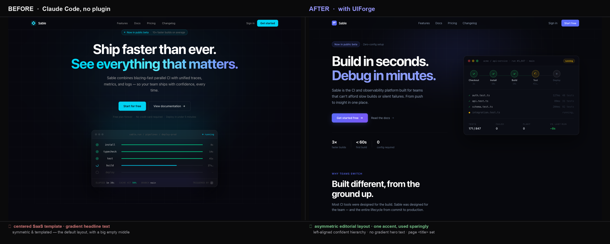

<h1 align="center">UIForge</h1>

<p align="center">
  <strong>AI slop이 아니라 명작 UI를 벼려낸다 — Claude Code용 디자인 아트 디렉터.</strong><br>
  <em>모든 디자인 축(타입·색·여백·모션·카피)마다 의도적 선택을 강제하고, 그 서명을 토큰으로 방출하며, 검증된 레지스트리에서 컴포넌트를 조달하고, 정당성 없는 것은 덜어낸다 — 그래서 결과가 "생성된" 게 아니라 "손으로 만든" 것처럼 읽힌다.</em>
</p>

<p align="center">
  <a href="./README.md">English README</a>
  &nbsp;·&nbsp;
  <a href="./skills/design-director/SKILL.md">Design Director</a>
  &nbsp;·&nbsp;
  <a href="./skills/design-director/references/anti-slop.md">Anti-slop</a>
  &nbsp;·&nbsp;
  <a href="./skills/design-director/references/directions.md">Directions</a>
</p>

<p align="center">
  
  
  
</p>

<p align="center">
  
  
  
  
</p>

---

> **한 문장:** AI UI가 slop인 건 *distributional convergence* 때문이다 — "예쁘게"라고
> 하면 모델이 최고확률 답, 즉 훈련데이터 중앙값(Inter·보라 그라디언트·중앙 히어로·카드
> 3장)을 낸다. 치료는 더 영리한 프롬프트가 아니라 **프로세스 + 제약**이다. UIForge의 일은
> 모든 축에서 **기본값을 결정으로 바꾸고** 그걸 강제하는 것.

- ✍️ **방출·강제되는 서명** — 토큰(`tokens.css` + `motion.ts`)을 *먼저* 쓰고, 빌드에서 토큰 밖 매직넘버를 스캔해 스케일로 되돌린다. 단일 정합 소스 — v0/Lovable 프리미엄 출력의 비결.
- 🚫 **명명된 slop-blocklist** — AI 티(보라 그라디언트 히어로·기본 폰트·글로우·이모지 아이콘·중앙 카드 3장·무한 마퀴…)를 1급 아티팩트 + **grep 린트 패턴**으로.
- ➖ **강제 뺄셈 게이트** — 빌드마다 가장 정당성 약한 요소 하나 제거. 다른 툴이 건너뛰는 단계.
- 🧩 **레지스트리 provenance** — 번들된 **shadcn MCP**로 검증된 컴포넌트를 설치, 손으로 창작 금지, prop 검증.
- 🎯 **관점 하나에 커밋** — 의견 있는 5개 방향(Editorial · Precise · Brutalist · Warm · Maximalist), 각각 구체 타입/색/여백/모션 서명.
- ♿ **reduced-motion & 모든 상태** — 정적 프레임이 스스로 좋아야 하고, loading/empty/error도 설계.

## 증거 (Proof)

같은 프롬프트·같은 모델·같은 스타터 — **유일한 변수는 플러그인**(격리된 헤드리스 2회 실행,
`--setting-sources project` ± 플러그인 — 다른 어떤 것도 양쪽을 돕지 못하게).

<p align="center"></p>
<p align="center"><em>같은 랜딩 상단(nav + hero + features) 제작. 없음: 중앙정렬 SaaS 템플릿 — 그라디언트 헤드라인·전부 대칭·큰 빈 여백. UIForge: 비대칭 에디토리얼 레이아웃 — 좌측 정렬 위계·절제된 액센트 하나·단색(그라디언트 아님) 헤드라인·페이지 <code>&lt;title&gt;</code> 설정.</em></p>

플러그인의 가장 크고 눈에 띄는 효과는 **프롬프트로 고치기 가장 어려운 축 — 레이아웃과
위계**다: 중앙정렬 템플릿을 깨고, 그라디언트 헤드라인을 버리고(그라디언트 사용 **14 → 5**),
관점 하나에 커밋한다. 왜 중요한가: **aesthetic-usability effect**(Kurosu & Kashimura,
1995) — 아름다운 UI는 더 쓰기 쉽다고 *인식*되고 더 큰 신뢰를 얻는다.

## 포지(forge) 파이프라인

1. **의도 논지** — 한 문장(대상 · 느낌 · 기억될 단 하나).
2. **방향 하나 커밋** — "모던하고 깔끔"이 아니라 진짜 관점.
3. **서명 먼저 방출** — `tokens.css` + `motion.ts`; 모든 값이 여기서 파생.
4. **레지스트리에서 조달** — 검증·접근성, 창작이 아니라 provenance.
5. **예산에 맞춰 조합** — 시그니처 하나, 나머지는 정적, 모든 상태 설계.
6. **블라인드 비평** — 렌더된 결과 판정(render + screenshot), slop 패턴 grep.
7. **강제 뺄셈** — 가장 정당성 약한 하나 제거. 필수.

## 설치

```
/plugin marketplace add TaewoooPark/UIForge
/plugin install uiforge@uiforge
```

로컬: `git clone https://github.com/TaewoooPark/UIForge.git && claude --plugin-dir ./UIForge`.
번들된 `.mcp.json`이 공식 **shadcn MCP**(`npx shadcn@latest mcp`)를 띄운다 — 커스텀 MCP 없음.

## 사용법

`design-director` 스킬은 UI 제작 의도에 자동 발동한다(명시 불필요). 또는 파이프라인을 직접 구동:

```
/uiforge:forge  개발자 도구 스타트업 가격 섹션, 절제되고 고급스럽게
/uiforge:setup                     # 이 프로젝트의 레지스트리 + 전제조건 준비
/uiforge:critique                  # 블라인드 비평 + 스크린샷 + 강제 뺄셈
```

## 스위트

| 부분 | 역할 |
|---|---|
| **`design-director`** 스킬 | 상시 브레인: 이론·포지 파이프라인·예산·slop-blocklist. 레퍼런스: [anti-slop](./skills/design-director/references/anti-slop.md) · [directions](./skills/design-director/references/directions.md) · [critique](./skills/design-director/references/critique.md) · [registry-map](./skills/design-director/references/registry-map.md). |
| **`design-tokens`** 스킬 | 서명 방출 + **강제**: 색 역할·타입 스케일·8px·radius/shadow·`motion.ts`. |
| **`motion`** 스킬 | 모션 레이어: 시그니처 하나, [easing/spring 정전](./skills/motion/references/easing-canon.md), Motion-Primitives, reduced-motion. |
| **`content`** 스킬 | 마이크로카피: 결과 라벨·실제 error/empty 상태·hype blocklist·구체성 테스트. |
| **`/forge` · `/setup` · `/critique`** | 파이프라인 구동 · 레지스트리 준비 · render→screenshot 루프 비평. |

## 방향 — 하나에 커밋

| 방향 | 성격 | 적합 |
|---|---|---|
| **Editorial** | 큰 타입·비대칭·넉넉한 여백 | 콘텐츠·포트폴리오·런치 |
| **Precise / Mechanical** | Swiss 그리드 × Linear; 차분·정확 | 개발 도구·대시보드·B2B |
| **Brutalist** | 원초적·고대비·두꺼운 하드 섀도 | 크리에이티브 브랜드·선언 |
| **Warm / Organic** | 부드럽고 스프링·인간적·따뜻한 뉴트럴 | 소비자·커뮤니티·온보딩 |
| **Maximalist** | 대담·레이어드·키네틱 — 그래도 시그니처 하나 | 캠페인·브랜드 마이크로사이트 |

전체 서명은 [`directions.md`](./skills/design-director/references/directions.md).

## 저장소 구조

```
UIForge/
├── README.md · README.ko.md · LICENSE
├── .claude-plugin/{plugin.json, marketplace.json}
├── .mcp.json                       # 공식 shadcn MCP (컴포넌트 provenance)
├── commands/{forge, setup, critique}.md
└── skills/
    ├── design-director/            # 브레인
    │   └── references/{anti-slop, directions, critique, registry-map}.md
    ├── design-tokens/              # 방출 + 강제
    │   └── references/{color, typography, space-layout}.md
    ├── motion/                     # 모션 레이어
    │   └── references/{directions, components, recipes, critique, easing-canon}.md
    └── content/                    # 마이크로카피
```

## 참고 & 한계

- **UIForge는 연출한다 — 탄탄한 기본기를 전제한다.** 좋은 판단과 진짜 콘텐츠 위에 *결정*을 얹을 뿐, 할 말 없는 페이지를 구제하진 않는다.
- **컴포넌트는 레지스트리에서, 창작하지 않는다.** Motion-Primitives는 beta — prop이 이상하면 소스로 검증.
- **Motion-Primitives 레지스트리 엔드포인트는 봇 체크포인트 뒤** — 자동/CI 요청은 `429` 가능, 인터랙티브 `npx shadcn add`는 동작, `npx motion-primitives@latest add <name>`이 상시 대안.

## 출처 & 정전(canon)

기반·캘리브레이션: **[Motion-Primitives](https://motion-primitives.com)**(@ibelick),
**[Motion](https://motion.dev)**, **[shadcn](https://ui.shadcn.com)**(레지스트리+MCP).
인코딩한 취향은 **Refactoring UI**, **Practical Typography**(Butterick), **Laws of UX**,
**Material / Radix / Tailwind** 토큰, **Emil Kowalski**·**Rauno Freiberg**의 모션 크래프트,
그리고 *distributional convergence*에 관한 **Anthropic**의 frontend-design 가이드에 기댔다.

원본 작업물은 [MIT](./LICENSE) — 플러그인·스킬·커맨드에 한함(설치되는 서드파티 라이브러리 제외).
